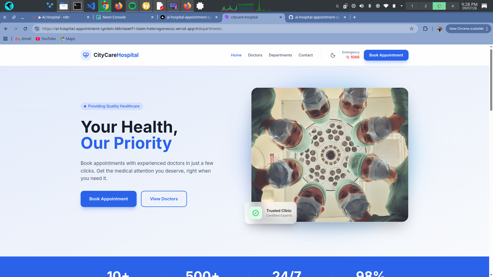
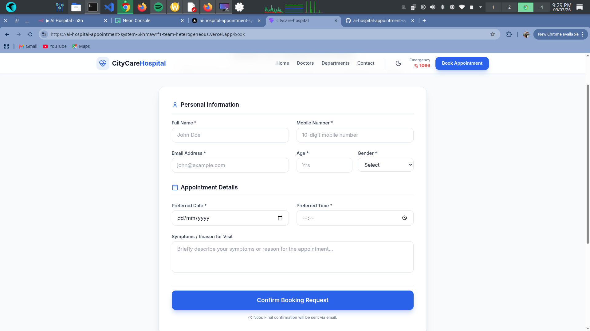
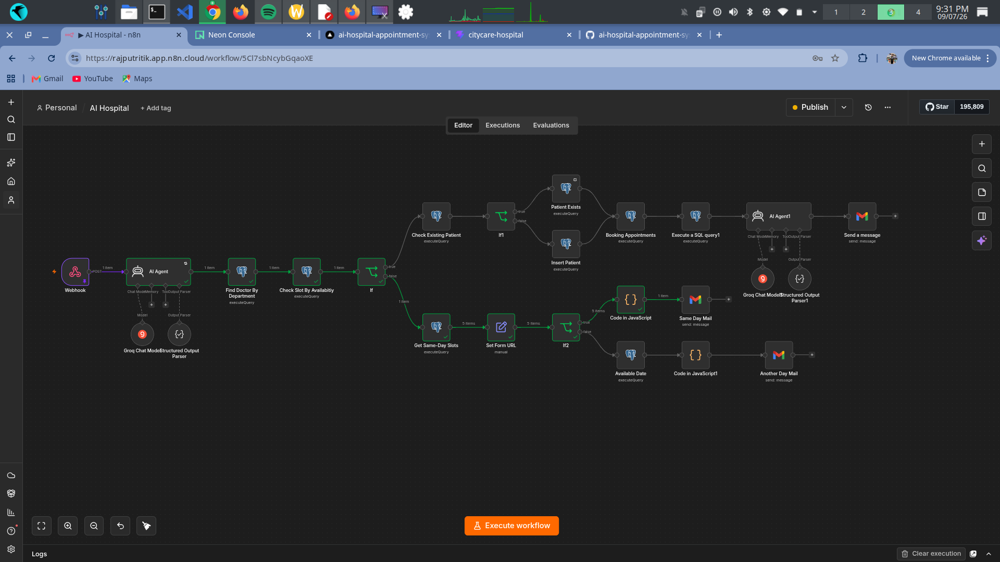
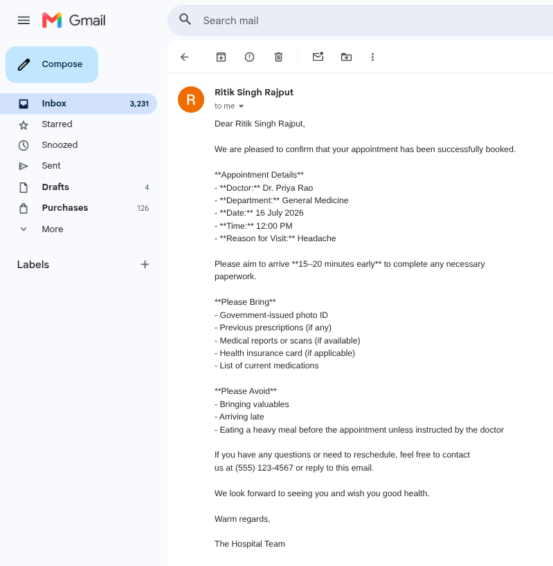
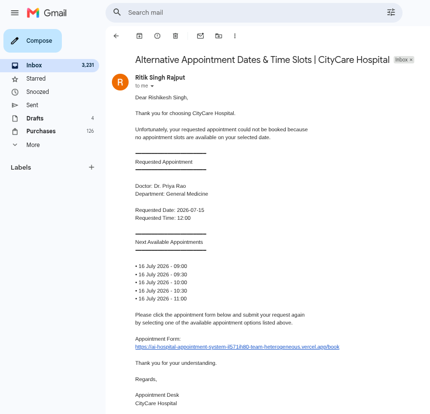
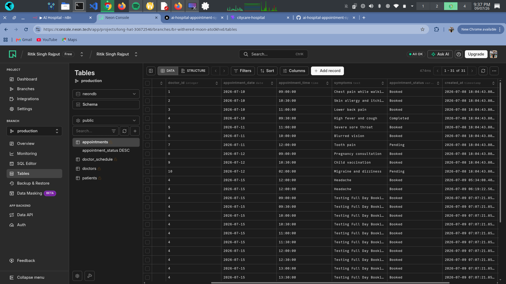

# 🏥 AI Hospital Appointment System

<p align="center">


</p>

---

# 📌 Overview

The **AI Hospital Appointment System** is an intelligent appointment booking platform that automates the complete scheduling workflow using **AI Agents, n8n automation, PostgreSQL, and a modern React frontend**.

Instead of manually handling appointments, the AI understands natural language, identifies the appropriate department and doctor, checks doctor availability, validates existing patients, books appointments, updates schedules, and sends personalized confirmation or rescheduling emails automatically.

This project demonstrates how **Agentic AI** can automate real-world healthcare workflows.

---

# ✨ Features

### 🤖 AI-Powered Appointment Booking

- Understands natural language appointment requests
- Extracts structured patient information using Gemini
- Automatically selects the correct department
- Finds the best doctor
- Checks doctor availability
- Suggests alternative slots when unavailable

---

### 👤 Patient Management

- Detects whether patient already exists
- Creates new patient records automatically
- Reuses existing patient information

---

### 📅 Smart Appointment Scheduling

- Books appointment instantly
- Prevents double booking
- Updates doctor's schedule
- Marks occupied slots unavailable

---

### 📧 Intelligent Email Notifications

Automatically sends:

✅ Appointment Confirmation

Includes:

- Doctor Name
- Department
- Appointment Date
- Appointment Time
- Hospital Instructions
- Things to Bring
- Arrival Guidelines

---

If requested slot is unavailable:

Automatically sends

- Available Time Slots
- Available Dates
- Rebooking Form Link

---

### 💾 Database Automation

Automatically updates

- Patients
- Doctors
- Doctor Schedule
- Appointments

without manual intervention.

---

# 🛠 Tech Stack

## Frontend

- React
- Vite
- Tailwind CSS
- JavaScript

## Backend Automation

- n8n

## AI

- Google Gemini
- Structured Output Parser

## Database

- PostgreSQL
- Neon Database

## Email

- Gmail Node (n8n)

---

# 🧠 AI Workflow

```
Patient fills Appointment Form
            │
            ▼
      AI Agent (Gemini)
            │
            ▼
 Extract Patient Information
            │
            ▼
 Find Doctor by Department
            │
            ▼
 Check Doctor Availability
            │
      ┌─────┴──────┐
      │            │
 Available      Not Available
      │            │
      ▼            ▼
Check Patient   Find Available Slots
      │            │
      ▼            ▼
Existing?     Send Alternative Email
      │
 ┌────┴────┐
 │         │
Yes       No
 │         │
 ▼         ▼
Book     Create Patient
 │
 ▼
Update Doctor Schedule
 │
 ▼
Send Confirmation Email
```

---

# 🗂 Database Schema

### Patients

- patient_id
- patient_name
- email
- phone
- age
- gender

---

### Doctors

- doctor_id
- doctor_name
- department
- specialization
- available_days
- start_time
- end_time

---

### Doctor Schedule

- schedule_id
- doctor_id
- available_date
- appointment_time
- is_available

---

### Appointments

- appointment_id
- patient_id
- doctor_id
- appointment_date
- appointment_time
- symptoms


# 📸 Screenshots

## 🏠 Home Page





## Appointment Booking





## AI Workflow





## Confirmation Email





## Slot Unavailable Email





## PostgreSQL Database





# 🚀 Workflow

1. User fills appointment form.
2. AI extracts patient information.
3. Department is identified.
4. Correct doctor is selected.
5. Doctor availability checked.
6. Existing patient verified.
7. Appointment booked.
8. Schedule updated.
9. Confirmation email sent.

If unavailable:

- Alternative slots found.
- Email sent with available slots.
- Patient resubmits form.

---

# 📂 Project Structure

```
AI-Hospital-Appointment-System
│
├── public
├── src
│   ├── assets
│   ├── components
│   ├── pages
│   ├── services
│   ├── utils
│   └── App.jsx
│
├── n8n
│   └── Hospital_Workflow.json
│
├── README.md
└── package.json
```

---

# ⚙️ Installation

Clone repository

```bash
git clone https://github.com/Rajputritik9695/ai-hospital-appointment-system.git
```

Move into project

```bash
cd ai-hospital-appointment-system
```

Install dependencies

```bash
npm install
```

Run locally

```bash
npm run dev
```

---

# 🔮 Future Improvements

- WhatsApp Appointment Notifications
- Appointment Cancellation
- Appointment Rescheduling
- Doctor Dashboard
- Admin Dashboard
- Patient Login
- Medical History
- PDF Prescription
- Payment Gateway
- Calendar Integration
- SMS Notifications

---

# 🌐 Live Demo

Frontend

```
https://your-vercel-link.vercel.app
```

n8n Workflow

```
https://your-n8n-instance.app.n8n.cloud
```

---

# 👨‍💻 Author

**Ritik Singh Rajput**

LinkedIn

https://www.linkedin.com/in/ritik-singh-rajput-49b964319/

GitHub


https://github.com/Rajputritik9695


---

# ⭐ Support

If you found this project useful, consider giving it a ⭐ on GitHub.

It helps others discover the project and motivates future improvements.
